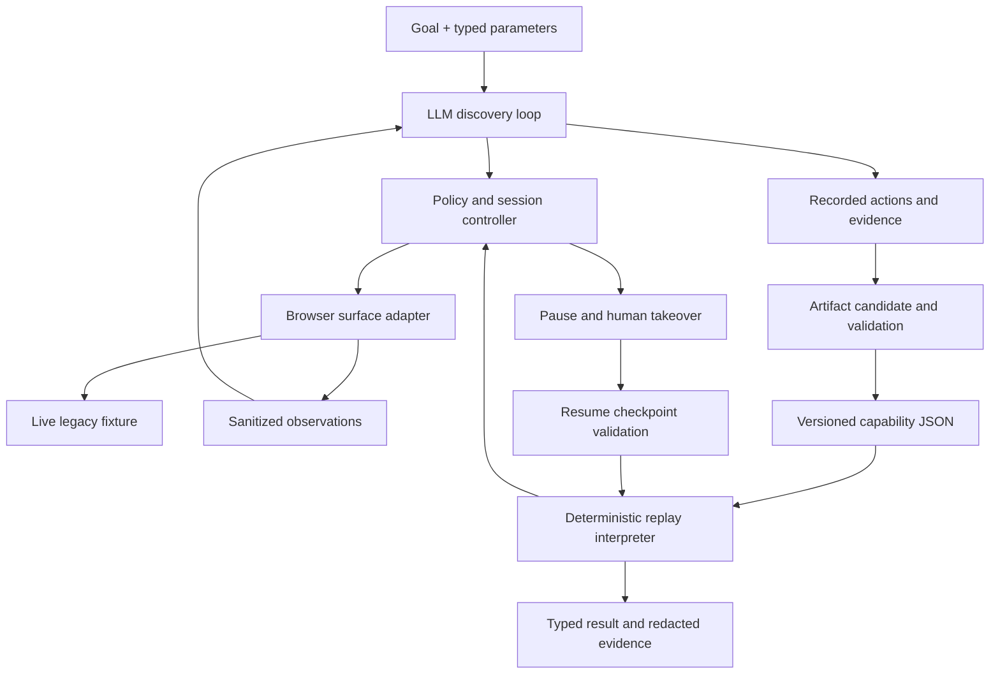

# CaseTrace design

Date: 2026-09-11. Planning baseline; application implementation has not started.

## Intent and decisions

Build a Python system that learns how to investigate an incoming payment by operating a legacy-style banking UI, saves a typed capability, and replays it with new inputs without a model. Demonstrate deliberate outcomes, bounded recovery, and a person taking over the same live browser session.

The source of requirements is `AComputer-Use Automation System.docx`, especially sections 3, 5, 6, and 7. The user selected CaseTrace, a one-week effort, and Python. Model API access still needs to be set up. The proposed integration is the Gemini Generate Content API; the model ID is an explicit configuration value, verified by an access check and recorded in discovery evidence. No live-service access is needed to implement or test the local core.

Global constraints:

- Python 3.12 or newer; one Python package and one implemented browser adapter.
- One capability: `trace_incoming_payment`; synthetic data only; incoming USD payments only.
- Automation interacts only with rendered application UI; no business API, fixture-data imports, hidden application state, or database reads.
- Replay cannot import or invoke a model provider, including during recovery or handoff.
- Every executable artifact path has declared checks, finite limits, and provenance.
- Only one actor may issue actions to a live session at a time.
- Credentials, tokens, full PII, and raw sensitive observations never enter persisted artifacts or logs.
- A real successful model-driven UI discovery and a replay of its saved artifact are mandatory before completion can be claimed.
- Complete a thin version of every core requirement before adding a stretch goal.

## Requirement coverage

| Brief | Implementation commitment | Acceptance evidence |
| --- | --- | --- |
| 3.1 Goal-driven loop | Goal, target, typed invocation values; observe/decide/act using a real model; bounded tool calls and elapsed time | Actual provider request IDs/model ID, sanitized tool decisions and observed UI transitions from a successful run |
| 3.2 Structured artifact | Versioned JSON contract with inputs, outputs, targets, actions, checks, branches, bounds, and provenance | Saved discovery-derived artifact; schema rejection tests; replay with different values |
| 3.3 Deterministic replay | Explicit interpreter and predicates; no model dependency; typed business outcomes and failures | Successful and exceptional replay matrix, identity checks, incomplete-search tests, blocked model egress |
| 3.4 Safety | Origin/route/action policy outside the model; deny financial writes; redaction before persistence | Disallowed action/navigation tests; secret and PII canary checks |
| 3.5 Evidence | Correlated JSONL events and sanitized UI snapshots; masked screenshots on supported screens | Evidence manifest links discovery, artifact hash, replay, failure, and handoff |
| 3.6 Handoff | Quiesce automation, transfer control of the same browser, capture manual actions, validate resumption | Human reauthentication demo; ownership/race tests; wrong-member resume rejection |
| 3.7 Heterogeneity and reuse | Surface protocol; vendor/version metadata; separate tenant bindings; unsupported-surface rejection | Design explanation and contract tests; second tenant is optional |
| 6 Deliverables | README, REPORT with exact headings, source, genuine evidence, final public GitHub repository | Clean-checkout instructions and evidence audit before publication |

## Workflow and search meaning

Example goal: "Find the incoming USD 250.00 payment for member 12345 between September 1 and September 7, 2026."

Typed invocation:

```json
{
  "member_id": "12345",
  "amount": "250.00",
  "currency": "USD",
  "date_from": "2026-09-01",
  "date_to": "2026-09-07",
  "reference": null
}
```

Contract decisions:

- `member_id` is exactly five digits and remains a string, preserving leading zeroes.
- `amount` is a positive decimal string with exactly two fractional digits; compare using `Decimal`, never binary floats.
- `currency` is the literal `USD`. Outgoing payments and other currencies are rejected as unsupported inputs.
- Dates are inclusive ISO calendar dates, with a maximum 31-day window. They refer to the displayed "Transaction date" field in the simulator, not inferred timestamps. Tenant metadata declares `America/Chicago`; no UTC conversion is applied to date-only values.
- `reference` is null or an exact, case-sensitive reference after trimming outer whitespace, with a maximum length of 40 characters. Amount/date alone is allowed but never resolves multiple matches by guessing.
- The search covers all deposit accounts listed for the member, transaction history and pending activity, and all pages within the declared limits. Both sources are checked even when the first contains a match.
- Bounds: at most 3 accounts, 3 pages per source per account, and 10 rows per page. Discovering more accounts/pages/rows produces `SEARCH_LIMIT_EXCEEDED`, never `NOT_FOUND`.
- Verify member identity before account enumeration, member/account identity before each source search, applied filters before consuming rows, and transaction identity before detail extraction.
- A candidate must match member/account context, CREDIT direction, exact amount/currency, date window, and optional reference. Rendered status must be POSTED, PENDING, or REVERSED; unknown status is a failure.
- A repeated row is deduplicated only by the verified composite identity `(member, account, transaction reference)`. Conflicting details for the same identity produce `INCONSISTENT_RECORD`; do not infer a status transition.
- A unique finding requires complete search coverage. Two distinct matches produce `AMBIGUOUS`. No matches after complete search produce `NOT_FOUND`.

This is a lookup and evidence-gathering capability. It does not determine payment-rail settlement, promise funds availability, resolve disputes, or submit financial changes. Simulator statuses are explicitly synthetic application behavior.

## Local target application

Use FastAPI, Jinja templates, and a small fixed synthetic dataset in a separately launched fixture process. Server-rendered form submissions constitute normal browser interaction. There is no JSON business endpoint exposed to the agent. FastAPI supports this small server-rendered approach through its [template integration](https://fastapi.tiangolo.com/advanced/templates/).

Three screen families:

1. Member search and member/account summary.
2. An account workspace with History and Pending navigation, filter forms, tables, and pagination.
3. Transaction detail, including verified account/reference and displayed status.

Use a persistent navigation frame plus a content frame, table layouts, duplicate generic button text, and some inputs whose visible labels are adjacent table cells rather than associated HTML labels. Do not add automation test IDs, hidden locator maps, or generated random obstacles. Keep the UI stable and usable by a person.

Fixture startup selects a deterministic scenario: `normal`, `slow-once`, `timeout`, `expire-once`, `permission-denied`, `stale-member`, `unknown-dialog`, `conflicting-record`, or `search-limit`. A harness selects scenarios through fixture process configuration before a run. Discovery/replay receive only the bank entry URL and never read scenario flags. A scenario may trigger on a specific application transition, but the automation must detect the resulting visible state.

The account UI also includes a synthetic financial-write control so policy tests can demonstrate denial before activation. Building a functioning transfer or refund workflow is outside scope. Browser input interception is not presented as a security barrier against a malicious local operator or browser developer tools.

## Architecture



Use an async Python runner so it can maintain the browser, record manual input, and serve a minimal operator page while waiting for intervention. The fixture runs independently. No queue, database, external operator service, or multi-agent runtime is needed.

Boundaries:

- `contracts.py`: Pydantic models and JSON Schema for capability, values, targets, predicates, operations, results, and events. [Discriminated unions](https://pydantic.dev/docs/validation/latest/concepts/unions/) express distinct operation/result types.
- `surface.py` and `browser.py`: observation, target resolution, action, deterministic condition evaluation, sanitized capture, and human event capture.
- `policy.py`: origin, route, action, and supported-control authorization; independent of model claims.
- `session.py` and `operator.py`: exclusive ownership, pause/resume state, intervention routing, and a local operator control page.
- `discovery.py`, `provider.py`, and `compiler.py`: model interaction, action recording, and conversion into a checked artifact candidate.
- `replay.py`: finite interpreter; no imports from provider/discovery/compiler.
- `matching.py`: exact payment matching and completeness checks, using values read from UI.
- `evidence.py`: redacted JSONL, sanitized snapshots, masked images, and evidence manifest.
- `cli.py`: fixture startup, access check, discovery, artifact validation, replay, and evidence checks.

## Artifact contract and discovery conversion

Serialize JSON, use `schema_version: "1.0"`, `capability_version: "0.1.0"`, and `capability_id: "trace_incoming_payment"`. Reject unknown schema versions rather than silently migrating. Use Pydantic's forbidden-extra-field configuration throughout.

Required top-level fields:

| Field | Meaning |
| --- | --- |
| `schema_version`, `capability_id`, `capability_version` | Contract and capability identity |
| `vendor`, `supported_app_versions`, `required_surface_features` | Compatibility requirements |
| `input_schema`, `output_schema` | Typed calling contract |
| `scope` | CREDIT/USD, account/source/date coverage, read-only effect |
| `targets` | Parameterized target definitions with frame/container context |
| `steps` | Ordered typed operations, conditions, bounded repetition, checkpoints |
| `handlers` | Known transient/session/error detectors and prescribed disposition |
| `limits` | Search bounds, step budgets, deadlines, retry and handoff limits |
| `provenance` | Discovery run/event references; authored/reviewed additions identified separately |
| `validation` | Exact artifact digest and scenario results used to establish replay coverage |

Artifact content is data, never arbitrary Python, JavaScript, shell code, or free-form expressions. A small tagged value model supports literal non-sensitive constants, input references, and run-local variable references. An extraction or condition uses a fixed enum of parsers/operators. There is no `eval`.

Operations: `navigate`, `fill`, `click`, `read`, `assert`, `branch`, `for_each`, `paginate`, and `return`. `read` supports text, exact money, date, enum, and table rows. `for_each` iterates a snapshotted collection with a fixed maximum. `paginate` follows a declared next-page target until a verified terminal state or its limit, rejecting repeated page fingerprints. Predicates are `visible`, `absent`, `equals`, `count`, `all`, and `any`; parameter/variable references are explicit. Branches must have disjoint guards or an explicit fallback failure. Retry/resume are controlled by handlers, not arbitrary jumps. Limit nesting to the needs of account/source/page traversal.

The model sees generic tool definitions and the business goal/contract, not the fixture source or a prewritten screen sequence. It observes visible text, control metadata, frame context, and optionally masked screenshots. It proposes one UI action at a time; the runner checks policy and captures the resulting transition. Model-supplied target descriptions are validated against the observed surface and must resolve uniquely before acting.

After a successful live run, the model may propose parameter bindings, output extractions, repetitions, and checkpoints from the recorded sequence. The compiler validates references, allowed operations, bounds, uniqueness, final identity checks, and static-versus-runtime data placement. The model's claim of completion is not sufficient; executable checks must pass against the live surface.

Generalization and branches are hypotheses until tested. Label provenance as `observed`, `generalized`, or `authored`. Every observed step points to real tool event IDs. Every generalized loop/binding and authored handler has a named validation scenario. The first candidate can be incomplete; only validated coverage is advertised. Do not hand-write the flagship navigation sequence and call it discovered. Unit-test artifacts may be authored, clearly labelled test fixtures.

Validation is a CLI action producing evidence for the exact artifact digest; it is not a full approval/catalog service. Normal replay rejects unresolved bindings or missing required validation coverage. Validation mode may exercise a draft under the same policy, and cannot quietly edit it. Any edit changes the digest and invalidates the old validation record. Compute the digest over executable artifact content excluding the validation report itself to avoid self-reference.

## Targeting and checkpoints

Target descriptions carry surface kind, frame path, container/anchor constraints, locator strategy, and expected cardinality. Prefer accessible role/name when present; implement visible-text plus adjacent-control or table-header/row relationships for poorly labelled controls. Locators contain parameter references rather than recorded member/payment literals. Avoid positional selectors and stored pixel coordinates. Playwright provides [scoped locators](https://playwright.dev/python/docs/locators) and [frame interaction](https://playwright.dev/python/docs/frames) for the browser implementation.

A permitted fallback is fixed in artifact data. All applicable strategies must agree on a unique target; ambiguity stops execution. Re-resolve immediately before action. A successful click means only that the input was delivered: navigation/filtering/member/account/detail assertions prove the intended effect. Check any error or authentication state before accepting a normal checkpoint. An unknown dialog or unsupported widget stops the run rather than triggering heuristic clicks.

Replay is deterministic in its decision rules, not a promise that changing banking data will produce identical values. All branch choices use declared predicates over fresh UI observations. Default action deadline is 10 seconds. Retry a verified read-only transient operation at most twice, with 250 ms then 1 second backoff. Never retry unknown-effect actions.

Discovery defaults: 40 model decisions, 100 UI actions, 10 minutes. Replay defaults: 200 UI actions and 5 minutes of active automation. Human wait has a separate 10-minute deadline, and a run allows at most two interventions. A cancellation or exhausted budget emits a structured terminal failure.

## Results and runtime states

Terminal results are a discriminated union:

- `success`: exactly one verified payment, status POSTED/PENDING/REVERSED, exact amount/currency/date, verified account/reference, `observed_at`, and evidence references.
- `business_outcome`: `NOT_FOUND`, `AMBIGUOUS`, `MEMBER_NOT_FOUND`, or `NO_ACCOUNTS`, plus coverage and redacted candidate summaries where applicable.
- `failure`: code, run ID, artifact digest, current step, expected condition, sanitized observed condition, attempt count, and evidence references.

Failure codes include `INVALID_INPUT`, `UNSUPPORTED_VERSION`, `UNSUPPORTED_SURFACE`, `POLICY_DENIED`, `ACCESS_DENIED`, `LOCATOR_AMBIGUOUS`, `CHECKPOINT_FAILED`, `SEARCH_LIMIT_EXCEEDED`, `TIMEOUT`, `INCONSISTENT_RECORD`, `UNKNOWN_STATE`, `MODEL_ERROR`, `MODEL_LIMIT`, `HANDOFF_TIMEOUT`, `SESSION_LOST`, and `CANCELLED`.

Recovery is an event on the way to a result, not a business outcome. `waiting_human` is a live run status, not a terminal success/failure. Permission denial is a hard failure; the handoff demo reauthenticates the same demo user and does not bypass permissions. Unknown dialogs may request intervention, but resumption still requires a known permitted state.

Programmatic results may contain authorized runtime values. Persisted results and the default CLI projection use redacted aliases and omit raw financial fields except explicitly synthetic fixture summaries. A real-data deployment would need a separate authenticated output channel, retention policy, and institution-approved redaction configuration; this demo does not claim production compliance.

## Safety and data handling

Browser automation is limited to the configured fixture origin and approved bank routes. The operator origin is separate and unavailable to the agent's browser tools. Check URL canonicalization, redirects, popups, subframes, resource requests, and observed form destinations. Deny unexpected origins before navigation requests complete; disable service workers in the controlled context. Normal same-origin assets are allowed. Model access is confined to the Python provider in discovery mode.

Action policies include control meaning and context; an allowlist containing merely `click` and `fill` is insufficient. Only supported inquiry controls can be activated automatically. Unknown submit buttons and financial-write controls are denied regardless of the model's proposed risk label. The fixture's bank routes/forms are reviewed policy bindings, not a scripted navigation plan. No shell, arbitrary script execution, download, clipboard, or filesystem tool is exposed to the model.

Risky actions are blocked in v1, an option explicitly allowed by brief 3.4. Human handoff addresses authentication/known safe recovery; a financial approval workflow is a documented cut. UI text is untrusted input and cannot alter the goal, policy, or artifact operation set. Include a fixture containing an instruction-like transaction description to verify policy remains effective.

Redaction is applied before log serialization, snapshot persistence, or model observation. Keep real input values in memory and reference them symbolically in action records. Use a field allowlist for events; provider responses, URLs/query strings, exception strings, and human input events must not be blindly dumped. Record brief action-purpose summaries, not private chain-of-thought.

The browser adapter creates a sanitized visible-state tree as the guaranteed richer failure signal. It contains labels, masked row/field values, state predicates, and target match counts. On recognized screens, resolve sensitive regions and capture an already masked screenshot; [Playwright screenshot masking](https://playwright.dev/python/docs/api/class-page#page-screenshot) is a primitive, not proof of complete redaction. Omit images on unknown screens or uncertain mask coverage and save the sanitized tree instead. Disable raw Playwright traces, videos, DOM dumps, network-body logs, and disk storage of browser authentication state. Human authentication screens receive no screenshot; input capture records field/action metadata only.

Use seeded secret, token, name, and account-number canaries in tests. Scan every persisted text artifact and inspect emitted screenshots; a byte scan does not establish that an image is safe.

## Human control transfer

State machine: `AUTOMATION -> PAUSING -> HUMAN -> VERIFYING -> AUTOMATION`, with terminal `COMPLETED`, `FAILED`, and `CANCELLED` states.

Every tool execution checks the session owner and ownership generation under the controller lock. Pausing rejects new automation commands and drains the in-flight action before reporting HUMAN ownership. Do not assume cancellation undoes a delivered click. Late results from an old generation cannot enqueue further actions.

The local operator page shows the run/capability, step, sanitized state, stop reason, and how to access the already-open headed browser. It offers Take control, Resume, and Abort, with state-appropriate availability. Serve it on loopback; reject cross-origin mutation requests and require a per-process anti-CSRF token. Resume does not accept arbitrary step IDs or injected artifact changes.

Use a context initialization script to capture manual click, change/input-field metadata, and navigation events in pages and frames. Do not capture typed values or password keystrokes. [Playwright initialization scripts](https://playwright.dev/python/docs/api/class-browsercontext#browser-context-add-init-script) apply across page/frame creation and navigation. A binding passes allowlisted event metadata to the controller. DOM recording does not cover browser chrome or native dialogs; disclose this limit and fail safe if those prevent verified resumption.

During AUTOMATION ownership, intercept ordinary human page input; an unexpected manual event pauses the run. This is coordination for a cooperative local operator, not OS-level isolation. During HUMAN ownership, automatic mutation count must remain zero, although observation/recording continues.

On resume, quiesce manual input, verify same browser/context/page IDs, allowlisted origin, authenticated user, and a recognized screen. If the person has returned to member search, restart the read-only search from the declared root checkpoint in the same session and clear all prior candidates/coverage. If the page is on the wrong member/account or an unsupported state, remain in intervention with an explicit reason. Do not silently continue from a stale step. No restart with a new browser, persisted-cookie reconstruction, or model recovery is allowed. Browser/process loss is `SESSION_LOST`.

Manual steps are run-local evidence, not automatic edits to the saved capability. A new learned capability would require separate discovery and validation.

## Heterogeneity and tenant reuse

The core surface protocol exposes observe, resolve/act, check, and sanitized capture. Browser frame/DOM details remain in its implementation. An eventual desktop adapter would use accessibility control relationships, window identity, and potentially visual anchors, with independent targeting and privacy work. A canvas-only surface is unsupported in v1; do not imply an interface alone provides desktop automation.

Artifact identity belongs to a vendor workflow and declared application versions. `TenantBindings` supplies origin, app version, visible label aliases, frame/container bindings, and privacy mappings. Overrides cannot change operation kinds, financial effects, or core identity/success checks. Validate any override with the same contract and scenario suite; key validation to artifact and binding digests. Runtime fingerprint mismatch returns incompatibility rather than trying arbitrary fallback locators.

The core reads one tenant binding file. Demonstrating a second slightly different fixture is the preferred single stretch goal after all core acceptance checks pass. No tenant administration, artifact registry service, or automatic drift repair is planned.

## Deliverables and evidence

At completion the repository contains source, locked setup dependencies, `/README.md`, `/REPORT.md`, and `/evidence/`.

REPORT is approximately 1-3 pages using exactly these seven headings:

1. Architecture
2. Artifact schema
3. Determinism & error handling
4. Heterogeneity & multi-tenant
5. Escalation & handoff
6. Safety
7. Cuts

Evidence contains the discovery-derived capability, sanitized discovery JSONL, normal replay JSONL, at least one exceptional replay, genuine human-handoff evidence, and a manifest with artifact/binding digests and commands. Include provider/model ID, request identifiers, timestamps, model-call count, step/checkpoint IDs, actor transitions, and sanitized observed outcomes. Do not fabricate missing discovery events, human actions, passing test results, or provider metadata. Simulated test actors must be clearly identified separately from the actual manual handoff demo.

Public repository preparation excludes secrets, temporary browser profiles, unredacted captures, and the original take-home document unless the user has permission to redistribute it. The source brief is a local planning reference; summarize its requirements in the public write-up. Public publication is a required submission step after implementation and evidence review, not an action performed during planning.

## One-week delivery order and cuts

Days 1-2 prioritize the fixture, protected browser primitives, real model access check, first genuine discovery, and the first replay of its artifact. Days 3-4 complete contract validation, search/error coverage, and handoff. Days 5-6 harden the exact behavior with focused tests, produce public-safe evidence, and rehearse. Day 7 verifies setup from a clean checkout and finishes the report and repository.

Cut desktop/OCR implementation, financial writes, automatic LLM recovery during replay, distributed infrastructure, a polished operator console, a general workflow builder, PDF case packets, and fuzzy payment matching. The useful case packet is a structured JSON result with evidence links. If schedule slips, omit the optional second tenant and cosmetic work; retain every core requirement.

Implementation completion requires a real LLM discovery, new-input replay with model egress disabled, all declared result paths verified, a human takeover/resume in the same session, a privacy audit, and reproducible submission commands. Passing authored offline tests alone does not meet that bar.
